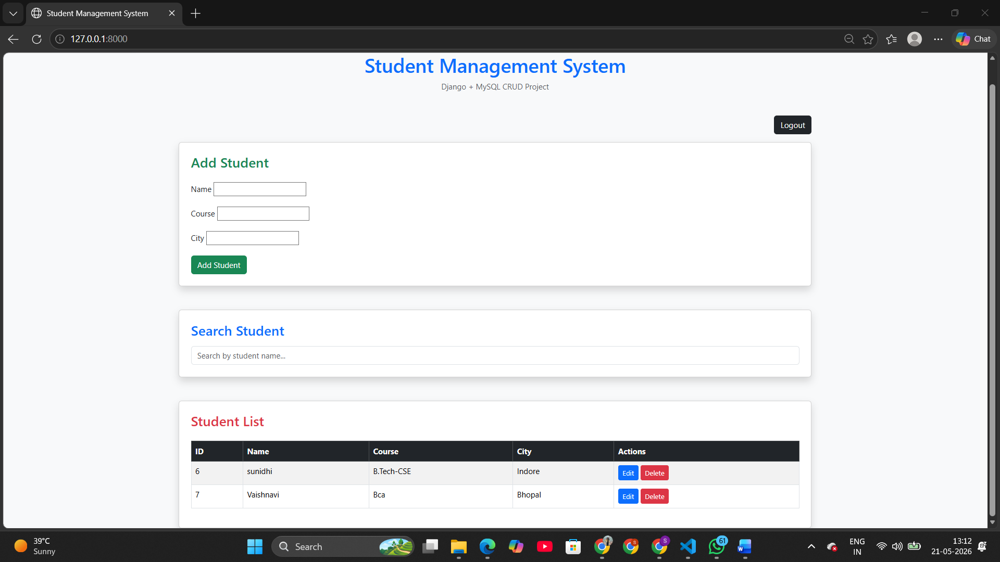
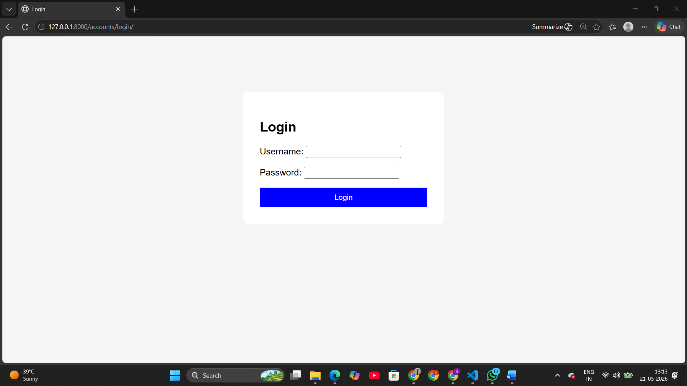
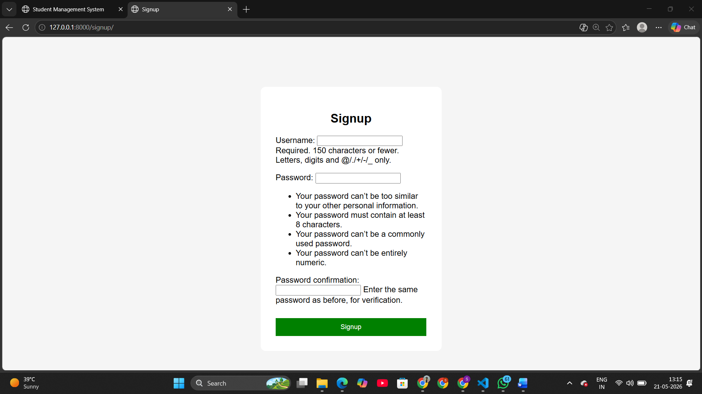
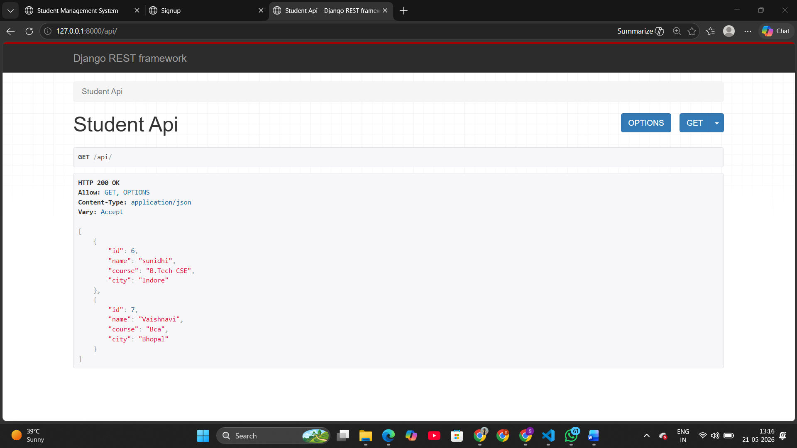

# Django Student Management System

A professional Student Management System built using Django, MySQL, Bootstrap and REST API.

Frontend Live Demo: https://django-student-management-system-chi.vercel.app/
Backend: https://django-student-management-system-r6hl.onrender.com/

## Features

- Add Student
- Delete Student
- Search Student
- Login / Signup
- REST API
- MySQL Database

## Tech Stack

- Python
- Django
- MySQL
- Bootstrap
- Django REST Framework

# 📸 Project Screenshots

## Home Page

---

## Login Page

---

## Signup Page

---

## REST API

